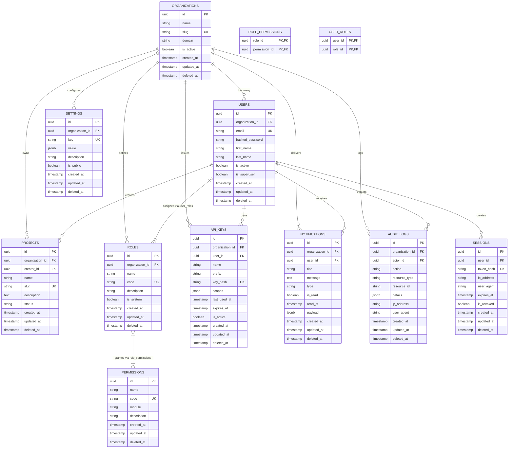

# SalesAI PostgreSQL Database Specification & ER Diagram

This document details the database architecture, schema definitions, entity relationships, indexing strategies, and soft delete patterns for **SalesAI** enterprise SaaS platform.

---

## 📐 Entity Relationship (ER) Diagram



---

## 🏛️ Key Architectural Principles

### 1. Primary Keys & UUID v4
All database tables utilize standard PostgreSQL `UUID v4` (`gen_random_uuid()`) primary keys. This ensures:
- Unique key generation across distributed nodes and multi-tenant sub-systems.
- Protection against sequential ID enumeration and scraping attacks.

### 2. Multi-Tenant Data Isolation
Multi-tenancy is enforced at the schema level via `organization_id` Foreign Keys on domain resources (`users`, `projects`, `roles`, `api_keys`, `notifications`, `settings`, `audit_logs`). 

### 3. Soft Delete Pattern (`SoftDeleteMixin`)
Domain records include a nullable `deleted_at` timestamp column.
- Active records: `deleted_at IS NULL`.
- Soft-deleted records: `deleted_at = '2026-07-28 13:00:00+00'`.
- Filtered compound indexes are created on `(organization_id, deleted_at)` to keep queries fast.

### 4. Automatic Audit Timestamps (`TimestampMixin`)
All tables automatically record:
- `created_at`: Timestamp with timezone when the row was created (`server_default=now()`).
- `updated_at`: Timestamp with timezone automatically updated on row updates (`onupdate=now()`).

---

## 📊 Database Schema Data Dictionary

### 1. `organizations`
Represents tenant workspace accounts.
| Column | Type | Constraints | Description |
| :--- | :--- | :--- | :--- |
| `id` | `UUID` | Primary Key | Unique tenant identifier |
| `name` | `VARCHAR(255)` | NOT NULL | Display name of organization |
| `slug` | `VARCHAR(255)` | UNIQUE, NOT NULL, Index | URL-friendly unique identifier |
| `domain` | `VARCHAR(255)` | NULL | Optional custom domain |
| `is_active` | `BOOLEAN` | NOT NULL, Default `TRUE` | Tenant active state flag |
| `created_at` | `TIMESTAMPTZ` | NOT NULL | Creation timestamp |
| `updated_at` | `TIMESTAMPTZ` | NOT NULL | Last update timestamp |
| `deleted_at` | `TIMESTAMPTZ` | NULL, Index | Soft delete timestamp |

---

### 2. `users`
System user accounts attached to an organization.
| Column | Type | Constraints | Description |
| :--- | :--- | :--- | :--- |
| `id` | `UUID` | Primary Key | Unique user identifier |
| `organization_id` | `UUID` | FK `organizations.id` (CASCADE), Index | Associated tenant ID |
| `email` | `VARCHAR(255)` | UNIQUE, NOT NULL, Index | Login email address |
| `hashed_password` | `VARCHAR(255)` | NOT NULL | Bcrypt / Argon2 password hash |
| `first_name` | `VARCHAR(100)` | NULL | First name |
| `last_name` | `VARCHAR(100)` | NULL | Last name |
| `is_active` | `BOOLEAN` | NOT NULL, Default `TRUE` | User account status |
| `is_superuser` | `BOOLEAN` | NOT NULL, Default `FALSE` | Global admin flag |
| `created_at` | `TIMESTAMPTZ` | NOT NULL | Creation timestamp |
| `updated_at` | `TIMESTAMPTZ` | NOT NULL | Last update timestamp |
| `deleted_at` | `TIMESTAMPTZ` | NULL, Index | Soft delete timestamp |

---

### 3. `projects`
Workspace projects created within an organization.
| Column | Type | Constraints | Description |
| :--- | :--- | :--- | :--- |
| `id` | `UUID` | Primary Key | Project ID |
| `organization_id` | `UUID` | FK `organizations.id` (CASCADE), Index | Tenant owner ID |
| `creator_id` | `UUID` | FK `users.id` (SET NULL), Index | Creator user ID |
| `name` | `VARCHAR(255)` | NOT NULL | Project name |
| `slug` | `VARCHAR(255)` | NOT NULL, Index | Project URL slug |
| `description` | `TEXT` | NULL | Detailed description |
| `status` | `VARCHAR(50)` | NOT NULL, Default `'active'`, Index | Project state (`active`, `archived`) |
| `created_at` | `TIMESTAMPTZ` | NOT NULL | Creation timestamp |
| `updated_at` | `TIMESTAMPTZ` | NOT NULL | Last update timestamp |
| `deleted_at` | `TIMESTAMPTZ` | NULL | Soft delete timestamp |
* **Unique Constraint**: `(organization_id, slug)`

---

### 4. `roles` & `permissions` (RBAC)
Role-Based Access Control configuration.

#### `roles`
| Column | Type | Constraints | Description |
| :--- | :--- | :--- | :--- |
| `id` | `UUID` | Primary Key | Role ID |
| `organization_id` | `UUID` | FK `organizations.id` (CASCADE), NULL | Custom org role or global system role |
| `name` | `VARCHAR(100)` | NOT NULL | Display name |
| `code` | `VARCHAR(100)` | NOT NULL | Machine role code (e.g. `admin`) |
| `description` | `VARCHAR(255)` | NULL | Description of role |
| `is_system` | `BOOLEAN` | NOT NULL, Default `FALSE` | Built-in system role flag |
* **Unique Constraint**: `(organization_id, code)`

#### `permissions`
| Column | Type | Constraints | Description |
| :--- | :--- | :--- | :--- |
| `id` | `UUID` | Primary Key | Permission ID |
| `name` | `VARCHAR(100)` | NOT NULL | Display permission name |
| `code` | `VARCHAR(100)` | UNIQUE, NOT NULL, Index | Permission action code (e.g., `projects:create`) |
| `module` | `VARCHAR(50)` | NOT NULL | Logical group (`users`, `projects`) |
| `description` | `VARCHAR(255)` | NULL | Detailed permission scope |

#### `user_roles` (Association)
Mapping between users and assigned roles (`user_id`, `role_id`).

#### `role_permissions` (Association)
Mapping between roles and granted permissions (`role_id`, `permission_id`).

---

### 5. `sessions`
Authentication user sessions.
| Column | Type | Constraints | Description |
| :--- | :--- | :--- | :--- |
| `id` | `UUID` | Primary Key | Session ID |
| `user_id` | `UUID` | FK `users.id` (CASCADE), Index | User ID |
| `token_hash` | `VARCHAR(255)` | UNIQUE, NOT NULL, Index | SHA-256 session token hash |
| `ip_address` | `VARCHAR(45)` | NULL | Origin IPv4/IPv6 address |
| `user_agent` | `VARCHAR(500)` | NULL | Device browser string |
| `expires_at` | `TIMESTAMPTZ` | NOT NULL, Index | Session expiration time |
| `is_revoked` | `BOOLEAN` | NOT NULL, Default `FALSE` | Manual revocation flag |

---

### 6. `api_keys`
Programmatic API keys for developer integration.
| Column | Type | Constraints | Description |
| :--- | :--- | :--- | :--- |
| `id` | `UUID` | Primary Key | API Key ID |
| `organization_id` | `UUID` | FK `organizations.id` (CASCADE), Index | Tenant ID |
| `user_id` | `UUID` | FK `users.id` (CASCADE), Index | Creator user ID |
| `name` | `VARCHAR(100)` | NOT NULL | Label for API key |
| `prefix` | `VARCHAR(16)` | NOT NULL, Index | Public key prefix (e.g., `sk_live_`) |
| `key_hash` | `VARCHAR(255)` | UNIQUE, NOT NULL, Index | Hash of full key secret |
| `scopes` | `JSONB` | NOT NULL, Default `'[]'` | List of allowed API scopes |
| `last_used_at` | `TIMESTAMPTZ` | NULL | Last API request timestamp |
| `expires_at` | `TIMESTAMPTZ` | NULL | Key expiration timestamp |
| `is_active` | `BOOLEAN` | NOT NULL, Default `TRUE` | Key active state |

---

### 7. `audit_logs`
Immutable activity audit events.
| Column | Type | Constraints | Description |
| :--- | :--- | :--- | :--- |
| `id` | `UUID` | Primary Key | Audit entry ID |
| `organization_id` | `UUID` | FK `organizations.id` (CASCADE), Index | Tenant ID |
| `actor_id` | `UUID` | FK `users.id` (SET NULL), Index | User who performed action |
| `action` | `VARCHAR(100)` | NOT NULL, Index | Event code (`user.login`, `project.delete`) |
| `resource_type` | `VARCHAR(100)` | NOT NULL, Index | Target entity type (`project`, `user`) |
| `resource_id` | `VARCHAR(255)` | NULL, Index | Target entity ID |
| `details` | `JSONB` | NULL | Detailed diff or payload context |
| `ip_address` | `VARCHAR(45)` | NULL | Request IP address |
| `user_agent` | `VARCHAR(500)` | NULL | Request user agent |

---

### 8. `notifications`
User alerts and system notifications.
| Column | Type | Constraints | Description |
| :--- | :--- | :--- | :--- |
| `id` | `UUID` | Primary Key | Notification ID |
| `organization_id` | `UUID` | FK `organizations.id` (CASCADE), Index | Tenant ID |
| `user_id` | `UUID` | FK `users.id` (CASCADE), Index | Recipient user ID |
| `title` | `VARCHAR(255)` | NOT NULL | Notification title |
| `message` | `TEXT` | NOT NULL | Body message text |
| `type` | `VARCHAR(50)` | NOT NULL, Default `'info'`, Index | Category (`info`, `warning`, `error`) |
| `is_read` | `BOOLEAN` | NOT NULL, Default `FALSE`, Index | Read receipt status |
| `read_at` | `TIMESTAMPTZ` | NULL | Timestamp when read |
| `payload` | `JSONB` | NULL | Action URL or payload data |

---

### 9. `settings`
Tenant and platform-wide configurations.
| Column | Type | Constraints | Description |
| :--- | :--- | :--- | :--- |
| `id` | `UUID` | Primary Key | Setting ID |
| `organization_id` | `UUID` | FK `organizations.id` (CASCADE), NULL, Index | Tenant ID (NULL for global settings) |
| `key` | `VARCHAR(100)` | NOT NULL, Index | Setting key (e.g., `theme`, `email_domain`) |
| `value` | `JSONB` | NOT NULL | Structured setting payload |
| `description` | `VARCHAR(255)` | NULL | Description of configuration |
| `is_public` | `BOOLEAN` | NOT NULL, Default `FALSE` | Public frontend access flag |
* **Unique Constraint**: `(organization_id, key)`

---

## ⚡ Database Migrations
Migrations are managed using **Alembic**.
- **Initial Revision**: [`alembic/versions/001_initial_schema.py`](file:///d:/Projects/Sales%20Agent/backend/alembic/versions/001_initial_schema.py)

To apply migrations against your PostgreSQL instance:
```bash
cd backend
alembic upgrade head
```
